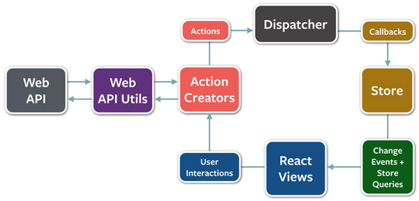

# Flux(和MVC不同的设计思想)

Store： 整个程序的状态中心（存储各个勾选框是否勾选，当前显示的页面是什么页面）

React View： View层，根据Store中的状态显示当前界面样式(如：Store中存储现在显示第二页，View根据这个状态显示第二页)

Action Creators： 逻辑层，根据用户点击处理逻辑，并发出对Store状态变化的请求。（如：用户下拉加载更多，发起网络更新数据，并根据获取到的数据，发出需要对Store新增数据的请求）

Dispatcher： 根据Action发来的修改请求，修改Store的数据，并由Store触发View的自动刷新

Flux的数据流向单一，不会出现A点击改变B状态，B点击后又修改C状态，又提交数据，这种复杂情况。所有事件统一用Action的方式修改Store，再由Store统一修改界面显示。

参考文档

http://www.ruanyifeng.com/blog/2016/01/flux.html